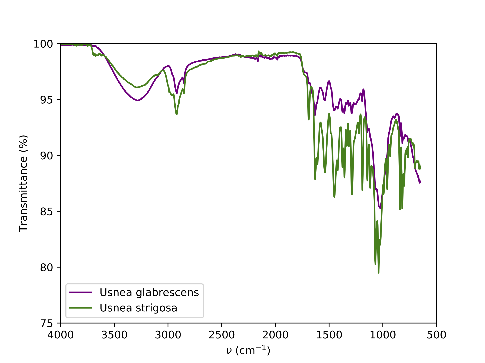

+++
title = "Figure Guide"
+++

\newcommand{\figenv}[3]{
~~~
<figure style="text-align:center;">

<figcaption>#1</figcaption>
</figure>
~~~
}

# Publication-quality Figures

All figures turned in should follow these guidelines.  Captions may be omitted except in reports.

## Data series

1. All data points and lines should be clearly legible (use thicker lines and bigger points if necessary).
1. If multiple series are plotted on the same plot, provide a clear legend explaining each.
1. Use color effectively, to differentiate data sets and provide symbolism where prudent, but don't rely on color to convey the point.
<!-- 1. If printing in black and white, all data series and legends should be clearly distinguishable *in black and white*.  Use different line types (dashed, dotted, solid, etc.) and shapes if necessary. -->

## Legends and Titles

Generally, main titles should *not* be used, and legends should only be used when needed.  If there is only one series on a plot, the legend should be removed.

## Axes

1. All axes should be clearly labeled, with units.
1. Axes should be scaled to show the data clearly; where practical, set the axes to cross at major scale divisions.  
1. Label axes with comprehensible numbers, in the range of 0.01 - 1000.  There are several ways to handle this:
     * 10,000,000 is hard to grasp and the large numbers clutter the axis; try dividing the axis by $10^6$ and use the M (mega) prefix before the units in the axis.
     * 2.5e-7 is hard to grasp and the exponents clutter the axis; label the axis as 2.5, and list an exponent of $10^7$ in the label.
     * Convert to another unit, such as percent abundance rather than raw abundance.

## Plot types

1. Use scatter plots (or line plots, a subset of scatter plots) for data with two continuous variables.  
1.  Use bar charts or box plots for data with one continuous and one categorical variable. (Bar charts are typically used for mass spectra.)
1. Use 3-D plots with extreme caution, and only when absolutely necessary.

## Saving plots

1. When possible, save plots as a vector graphic (PDF or SVG); this provides infinite resolution.  If using a vector graphic isn't an option, save raster graphics (jpeg, PNG, TIFF) at a resolution of at least 300 dpi for printing in a paper, higher for a poster or presentation.

<!-- 1. Very often, you may need to make final edits to your plot in a vector or image editing program (e.g. Adobe Illustrator, Gravit Designer, Inkscape, Adobe Photoshop, GNU Gimp, etc.).  You can use this to, e.g., increase the font size on axes, add chemical structures to images, or combine subfigures into a single, multi-pane figure.  If you don't want to use any of the above programs, Microsoft PowerPoint works almost as well. -->

## Displaying plots

1. Plots (figures) should be displayed in a manuscript in the order in which they are discussed.    
1. Correspondingly, each figure should be specifically referenced in the text.
1. Chart titles should be avoided; instead, each figure should have a caption below the figure that reads:

     > Figure *n*: A brief title. A brief description of figure *n*.

## Examples

### A Publication-quality infrared spectrum

The *following* figure is an example of a publication-quality infrared spectrum. The data series are clearly distinguishable with contrasting colors, the lines are clearly visible, and axes are clearly and intuitively labeled (with units), and there is an appropriate caption.  Moreover, the figure is clear, undistorted, and unpixellated. Note that the caption for this image includes a summary of the key message of the figure.

**Figure 1:** Example normalized ATR FT-IR spectra of *Usnea* lichens.    The two species have clearly distinguishable spectra.  Notably, *U. strigosa* has a less intense -OH stretch peak but more intense bands in the fingerprint region.

### What Not to Do

The **following** figure is an example of what **not to do**!  Key problems:
- The axes are either unlabelled or labelled poorly; although there is a legend, the names are incomprehensible.
- There are far too many ticks labeled on both axes.
- The scale on the *y*-axis needs to be tightened to more clearly show the data.
- The gridlines are overpowering compared to the data.
- The lines representing the data are too thin and the colors to not contrast enough.
- The chart is pixellated and distorted.
- The caption is terse and unnumbered.

\figenv{spectra of sample}{/figures/bad.png}{width:\textwidth}

