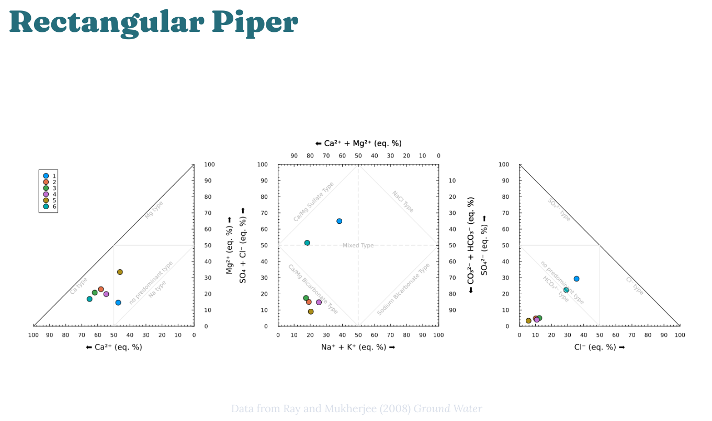

+++
title = "Hydrochemical Facies"
+++

Hydrochemical Facies
=========================

\toc

# Background

Water samples may be described by their chemical makeup, and the field of geochemistry has developed specific, standard ways of plotting the chemical makeup of water.  Often, this referred to as an analysis of hydrochemical facies, where a facies (singular!) is a geochemical body with distinctive characteristics.  Thus, analysis of geochemical facies provides a way of understanding which samples have a distinct chemical makeup with respect to important hydrologic parameters.  Learning to interpret and prepare these plots is an important step toward becoming fluent in the language of aquatic chemistry.

Before you continue, read sections 2.4.2 and 2.4.3 in Water Chemistry (p. 72-76), paying special attention to Figures 2.6 and 2.7.

If you wish to use MATLAB to process your data, you can work from the live script here: [MATLAB Live Script](https://drive.mathworks.com/sharing/b119bae0-156f-4169-acb1-e10aeb16ddd2).  (MATLAB is availble with no charge when using your WCU email to log in.)

# Exercise

## Obtain your dataset

You will work with publicly available data for this exercise.  The NC Department of Environmental Quality (NCDEQ) provides rich datasets for groundwater wells around the state, and this dataset will be used in this lab.  You will choose a unique site for your analysis.

1.  Navigate to [NC Water](https://www.ncwater.org/?page=343) in a web browser.
2.  Click on the monitoring site you wish to work with; please choose a site different from others in the class, so that we are able to observe many different sites across the state.
3.  You will be taken to a site-specific page; once there, click on the specific well you wish to work with, then click Download WQ data, and finally click  download your data (labres_your_site_number.csv).  If you do not see the link to download WQ data it is not available for that well and you must choose a different well or site!
4.  Find the downloaded CSV file on your computer, and upload it to MATLAB Drive.

## Import and preprocess your data

1. Import your data to your preferred data analyis software.  In Excel, for example, go to File > Open and browse for your CSV data file.
2. Find the following ions in your dataset: Ca, Mg, Na, and K (these are the cations) and carbonate, bicarbonate, sulfate, and chloride (these are the anions).  Some files contain multiple measurements, so make sure you are working only with one measurement.
3. Convert the concentrations for these ions to meq/L.

## Plot your data

Typically, the ions would be plotted on a Piper diagram.  However, this is difficult to do in Excel and other plots types that are easier to make can display identical information.  We will use both a Chadha diagram here and rectangular Piper diagram here.  For your projects, you can use whichever you prefer.  Examples are shown [below](http://chem330.github.io/hydrochemical-facies/#example_plots).

### Rectangular Piper Diagram

1. First prepare the cation plot:
   1. Create a x-y scatter plot with $\ce{ [Ca^2+] }$ on the x-axis (in meq/L) and $\ce{ [Mg^2+] }$ on the y-axis (in meq/L).
   2. Adjust the axes and other plot parameters until they look like the left side of the rectangular Piper diagram shown below. (You are not required to show the grey lines of different types for now, just the overall plot.)
   3. You should have a single point on your plot, since you are only working with one sample.
2. Next, create the anion plot:
   1. Create a x-y scatter plot with $\ce{ [Cl-]}$ on the x-axis (in meq/L) and $\ce{ [SO_4^{2-} ] }$ on the y-axis (in meq/L).
   2. Adjust the axes and other plot parameters until they look like the right side of the rectangular Piper diagram shown below. (You are not required to show the grey lines of different types for now, just the overall plot.)
   3. You should have a single point on your plot, since you are only working with one sample.
3. Finally, create the combined anion-cation plot.
   1. Create a x-y scatter plot with the sum of $\ce{ [Na+] }$ and $\ce{ K+ }$ on the x-axis (in meq/L) and the sum of $\ce{ [Cl-]}$ and $\ce{ [SO4^{2-}] }$ on the y-axis (in meq/L).
   2. Adjust the axes and other plot parameters until they look like the middle panel of the rectangular Piper diagram shown below. (You are not required to show the grey lines of different types for now, just the overall plot.)  Make sure to add label for all 4 axes.
   3. You should have a single point on your plot, since you are only working with one sample.

### Chadha Diagram

1. Create an x-y scatter plot with the sum of $\ce{ Ca^{2+} }$ and $\ce{ Mg^{2+} }$ minus the sum of $\ce{ Na+ }$ and $\ce{ K+ }$ on the x-axis and the sum of carbonate and bicarbonate minus the sum of chloride and sulfate on the y-axis:

	$$\text{x-axis: } \ce{ ([Ca^{2+}] + [Mg^{2+}]) - ([Na+] + [K+]) }$$
	$$\text{y-axis: } \ce{ ([HCO3^-] + [CO3^{2-}]) - ([Cl-] + [SO4^{2-}]) }$$
	
2. Adjust the axes and other plot parameters until they look like the middle panel of the rectangular Piper diagram shown below. (You are not required to show the grey lines of different types for now, just the overall plot.  However, they should be relatively straightforward to add and would make your plot standout!)

3. You should have a single point on your plot, since you are only working with one sample.

# What to turn in

1. Complete the steps above and turn in the requested plots on Canvas. 
2. Complete the Canvas post-lab quiz for this assignment.

# Example Plots

*If the plots are small on your screen, try right click > open image in new tab.*

